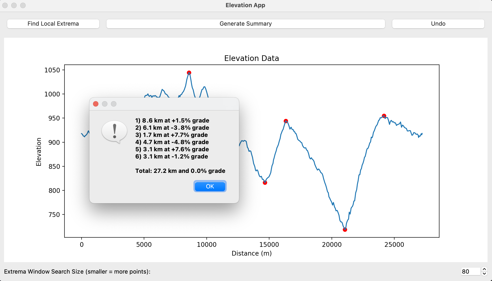

# SlopeSense

SlopeSense is a simple PyQt-based application that allows you to load and analyze elevation data from GPX files. It provides a graphical representation of the elevation profile and allows you to select and analyze specific points on the profile to help you plan ahead. The application can also automatically find and use significant extrema. It is designed to be simple and easy to use, and it is intended to be used as a tool to help you plan your route.



## Features

- Load and visualize elevation data from GPX files
- Select and mark specific points on the elevation profile
- Calculate and display summary information such as total distance and grade
- Find local extrema (minima and maxima) in the elevation data
- Undo the last selected point
- Interactive mouse hover to display the elevation of points

## Requirements

- Python 3.7 or above
- Libraries:
  - xml.etree.ElementTree
  - numpy
  - geopy
  - PyQt5
  - matplotlib

## Installation

1. Clone the repository:

   ```bash
   git clone https://github.com/your-username/elevation-app.git
   ```

2. Install the required libraries using pip:

   ```bash
   cd elevation-app
   pip install -r requirements.txt
   ```

## Usage

To run SlopeSense, use the following command:

```bash
python slope_sense.py path/to/route.gpx
```

Replace `path/to/route.gpx` with the path to your GPX file. You can try it out the provided sample GPX file, `sample_route.gpx`.

## License

This project is licensed under the MIT License. See the [LICENSE](LICENSE) file for more information.
